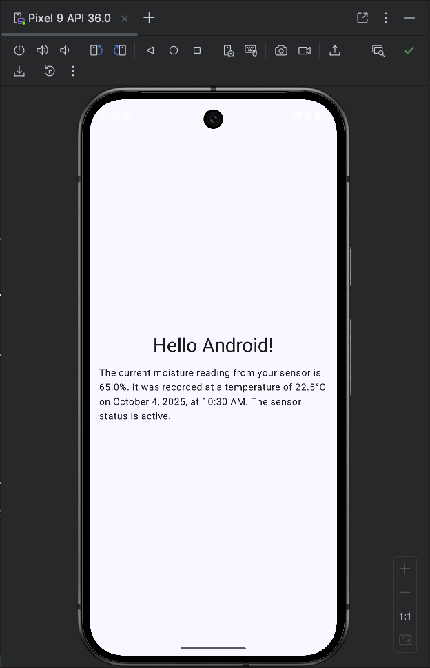

# PlantPal — Firebase Functions (Python)

This repository contains a small PlantPal prototype: a simple chat-bot agent (see `agent.py`) with helper utilities (`iot_tools.py`) and a Python Cloud Function wrapper (`main.py`) so an Android app can talk to the agent through Firebase Callable Functions. The agent implementation is intentionally minimal — it exposes a chat API that the callable function `plantpal_chat` invokes and returns a JSON response { "response": ..., "success": true }.

Run and test everything locally using the Firebase Functions emulator. Start the functions emulator from the `firebase/functions` directory (or project root) with:
```
firebase emulators:start --only functions
```

Connecting the Android app to the local emulator
- The Android emulator accesses the host machine on `10.0.2.2`. When testing with the Functions emulator you must point the Firebase Functions client at that address and allow cleartext/local traffic:
  - Add the network security config file at:
    `PlantPal/android/app/src/main/res/xml/network_security_config.xml`
    (whitelist local HTTP traffic so the emulator can reach your functions).
  - Configure the functions client in your Android app:
```kotlin
functions = Firebase.functions
// uncomment when testing locally with firebase functions emulator
functions.useEmulator("10.0.2.2", 5001)
```
- Use the Firebase Android SDK Callable Functions API to call `plantpal_chat` (e.g., `functions.getHttpsCallable("plantpal_chat").call(data)`) from a coroutine or background thread.

### Resources
- Firebase Cloud Functions getting started: https://firebase.google.com/docs/functions/get-started

### Screenshot
Example screen of running app:

